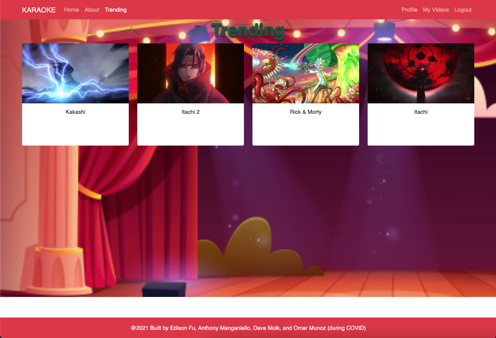

# Cheraoke

[APP ADDRESS]

Unlock your inner karaoke superstar with Cheraoke! Log in and search for a song you'd like to sing. Once you select the karaoke version you want, you'll be taken to the record page where you can record and then upload your new hit! Don't like what you did? Simply turn back time and try again. You don't have to sing a song by Cher, but are you really living life to the fullest if you don't?


[SCREEN SHOTS]

# Techonologies Used

This is a MERN project with the following highlights:

- Passport / Bcrypt for authentication and password hashing
- YouTube API
- Cameratag

## User Stories

You don't have to love Cher to love Cheraoke (but you'd be a lot cooler if you did). This app is designed to give everyone the chance to shine behind the mic. If you like to sing, this is the app for you!

- As a user, I want to...
  - be able to search for karaoke verisons of my favorite tunes.
  - record myself singing along.
  - access my recordings whenever I log into Cheraoke.

## Models

- User
  - Purpose: store signed-up user information
  - Fields: name, email, password, profilePic
- Video
  - Purpose: store all video data for signed-up users
  - Fields: url, title, description, likes, comments, public, thumbnail
- Comment
  - Purpose: store all comment data for videos
  - Fields: content, likes

## Route Highlights

- Trending Route

```javascript
const trending = async (req, res) => {
  try {
    const videos = await Video.find().sort({ likes: -1 }).limit(25);
    if (!videos) {
      return res.status(400).json({ message: "No videos found...." });
    } else {
      res.json(videos);
    }
  } catch (error) {
    console.log("---Error inside of /api/videos/trending");
    console.log(error);
    return res.status(400).json({ message: "Videos not found. Try again..." });
  }
};
```

- Create Video Route

```javascript
const create = async (req, res) => {
  try {
    console.log("---create route---");
    const { userId, url, title, description, thumbnail, public } = req.body;
    const findUser = await User.findById(userId, async (err, user) => {
      const thisVideo = await new Video({
        url: url,
        title: title,
        description: description,
        public: public,
        thumbnail: thumbnail,
      }).save();
      user.videos.push(thisVideo);
      user.save();
      res.json(thisVideo);
    });
  } catch (error) {
    console.log("---Error inside of create /api/videos---");
    console.log(error);
    return res.status(400).json({ message: "Video not created. Try again..." });
  }
};
```

## Steps to Setting Up

If you'd like to set this project up on your own local server:

- Fork and clone the repositories for front end and back end.
- Run `npm install` in each to install dependencies.
- Create .env file in each. The front end should include
- REACT_APP_SERVER_URL=http://localhost:8000
- REACT_APP_API_KEY=<your YouTube API key>
  The back end should include:
- JWT_SECRET <you provide>
- MONGO_URI=mongodb://localhost/karaoke
- Review database setup and check mongoDB to confirm data

## Next Steps

Music is a social experience, and the next iterations of Cheraoke will embrace this. Here are just a few of the many plans we have for future versions of this app:

- Build in the ability to follow other users.
- Allow different people to sing and/or comment in real-time using Firebase to synchronize events across clients.
- Enable users to upload portfolio pics.
- Allow users to make their profiles public, followers-only, or fully private.
- Enable filters on video.
